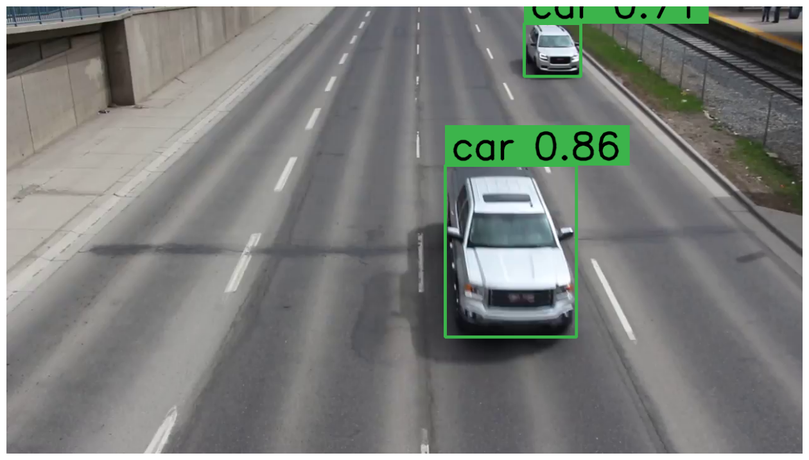

# Track-Count-Vehicles-Using-Roboflow (YOLOv8 Model)

## Project Description

Detect and count vehicles in the video frame Using YOLOv8 Model and Supervision 

## Libraries used
Supervision

BYTEtracker

LineZone

BoxTracker

## Dataset
The Video was obtained from youtube [here](https://www.youtube.com/watch?v=Y1jTEyb3wiI)

## Output
### 1.) In Frame 
Shows The probability the predicted Image is a car

### 2) Video OutPut
<video width="1280" height="720" controls>
  <source src="Video 2.mp4" type="video/mp4">
  Your browser does not support the video tag.
</video>
